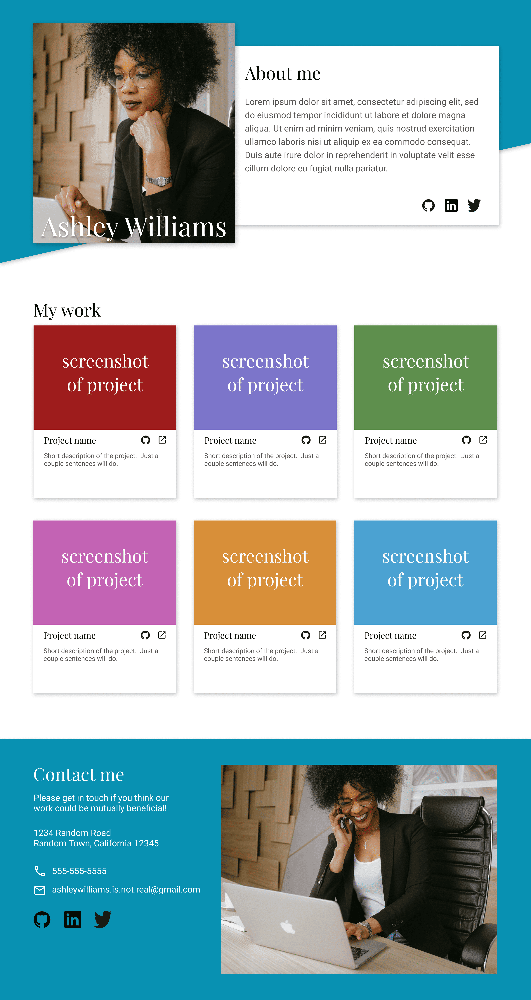

# top-responsive-homepage
A responsive homepage HTML&CSS assignment from The Odin Project. Create a responsive web page that follows the given design files.

## Designs
### Desktop:
 
  

### Tablet:
 
  

### Mobile:
 